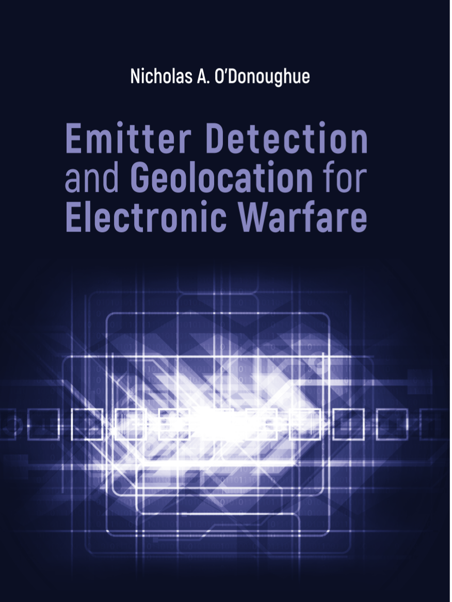
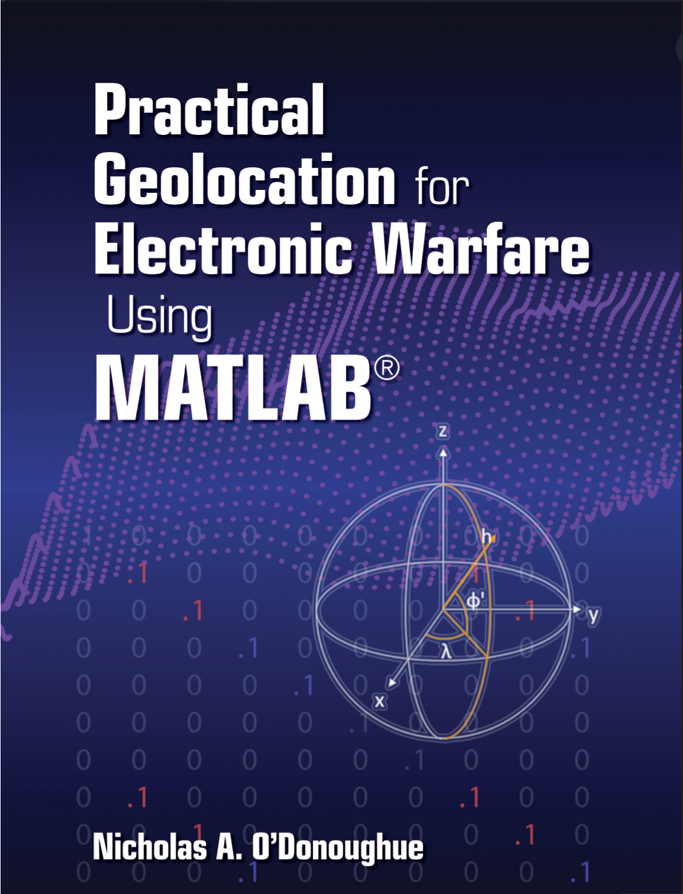

# MATLAB Companion to Emitter Detection and Geolocation for Electronic Warfare

This repository contains the MATLAB code, released under the MIT License, that generates all of the figures and implements all of the algorithms and many of the performance calculations within the texts *Emitter Detection and Geolocation for Electronic Warfare,* by Nicholas A. O'Donoughue, Artech House, 2019 and *Practical Geolocation for Electronic Warfare using MATLAB,* by Nicholas A. O'Donoughue, Artech House, 2022.

The textbooks can be purchased from Artech House directly at the following links: **[Emitter Detection and Geolocation for Electronic Warfare](https://us.artechhouse.com/Emitter-Detection-and-Geolocation-for-Electronic-Warfare-P2291.aspx)**, and **[Practical Geolocation for Electronic Warfare using MATLAB](https://us.artechhouse.com/Practical-Geolocation-for-Electronic-Warfare-Using-MATLAB-P2292.aspx)** Both are also available from Amazon.

A python port is in progress, check the **[git repository](https://github.com/nodonoughue/emitter-detection-python)**.

### Update 20221027 -- Additional Features Complete
This repository now contains code for several new features, discussed in the second textbook.

A few of the new features include:
+ Scripts for handling 3D coordinate systems (including ENU, ECEF, and Geodetic Lat/Lon)
+ The ability to specify arbitrary test/reference sensor pairs for TDOA and FDOA (as opposed to setting the final sensor to be a common reference), along with code to modify covariance matrices to translate from sensor-level errors (TOA/FOA on each sensor) to measurement-level (covariance of TDOA and FDOA measurements between sensor pairs). Many of the examples from the first textbook have been updated to refer to the new utilities.
+ Generic solvers for constrained cases (see the **+utils/+constraints/** folder).
Examples for the second book are contained in the **examples/** folder, and contain the prefix **book2_**; figure generator functions contain the same prefix.

## Installation

Simply open the folder in MATLAB or add the root folder containing this repository to the MATLAB search path.  Clone this repository, or download the latest release from the Mathworks File Exchange.

## Figures

To generate the figures in the book, execute the script **runAll.m**. 

*Warning: Some of the figures are generated through a Monte Carlo simulation that can take several hours to complete.  For this reason, the variable **force_recalc** is set to False, which will skip any figures that were generated with a lengthy simulation.  To generate those figures, set force_recalc=True.*

Alternatively, one can call one of the chapter specific scripts in the folder make_figures, such as:

    force_recalc=True;
	make_figures/ch1_drawFigures;

Files with the prefix **make_figures/book2_** generate figures from the second textbook.

The output will be stored in the **figures/** folder. Output for the second book will be placed in a nested folder called **practicalGeo/** under the **figures/** folder.

## Examples
The **examples/** folder contains the code to execute each of the examples in the textbook. Files with the prefix **book2_** refer to the second textbook.

## Homework
The **hw/** folder contains data sets used for two homework problems in Chapter 8.

## Live Scripts
The **live_scripts/** folder contains MATLAB Live script versions for the examples in **examples/**.  It is currently a work in progress, and more will be added over the coming weeks.  [MATLAB Live scripts](https://www.mathworks.com/help/matlab/matlab_prog/what-is-a-live-script-or-function.html) blend text and code to enable interactive learning.

## Test Scripts
The **testscripts/** folder is used to house test scripts, to ensure that utilities are operating as functions, and to enable regression testing in the future. Currently, there is only a single test script, used to verify that coordinate conversions are internally consistent.
## Utilities
A number of utilities are provided in this repository, under the following namespaces:

+ **+aoa/** Code to execute angle-of-arrival estimation, as discussed in Chapter 7
+ **+array/** Code to execute array-based angle-of-arrival estimation, as discussed in Chapter 8
+ **+atm/** Code to model atmospheric loss, as discussed in Appendix Carlo
+ **+detector/** Code to model detection performance, as discussed in Chapter 3-4
+ **+fdoa/** Code to execute Frequency Difference of Arrival (FDOA) geolocation processing, as discussed in Chapter 12.
+ **+hybrid/** Code to execute hybrid geolocation processing, as discussed in Chapter 13.
+ **+noise/** Code to model noise power, as discussed in Appendix D.
+ **+prop/** Code to model propagation losses, as discussed in Appendix B.
+ **+tdoa/** Code to execute Time Difference of Arrival (TDOA) geolocation processing, as discussed in Chapter 11.
+ **+tracker/** Code to implement simplified tracker scenarios, discussed in Chapters 7 and 8 of the second book.
+ **+triang/** Code to model triangulation from multiple AOA measurements, as discussed in Chapter 10.
+ **+utils/** Generic utilities, including numerical solvers used in geolocation algorithms.

## Feedback
Please submit any suggestions, bugs, or comments to nicholas [dot] odonoughue [at] ieee [dot] org.
